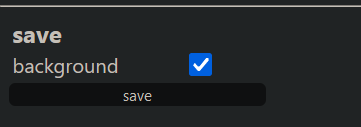
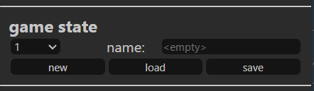

# About

__Hexketch__ is a website that allows you to easily generate images of hexagonal tiles on a hexagonal grid.
This website was made with [P5.js](https://p5js.org/) and [BHex.js](https://github.com/bodinaren/BHex.js). 
Hex grid reference from [Amit Patel](https://www.redblobgames.com/grids/hexagons/).
Inclusive color palettes from [Paul Tol](https://personal.sron.nl/~pault/).
Font used in the icon is [Zyzol](https://www.fontspace.com/zyzol-font-f67557).

---

# How to use

## Function Section

There are different __elements__ you can use to create your own image: _tiles_, _outlines_, _highlights_, _arrows_, and _comments_. You can place them in different positions of the canvas with your mouse cursor after selecting an __action__: you can _add_, _move_, _edit_, and _delete_ figures, but keep in mind that there are many __elements__ that can share the same coordinates so to make a change you need to always select an __element__ AND an __action__ first.

Add a piece: after you select an __element__, some specific parameters will show for you to select or change. If you want to change these parameters later you can use the _edit_ __action__.


## Board Section

Adjust the board to different sizes, positions and orientation. You can even hide the grid if you want.


## Color Section

In this section you can adjust the background color and change general color preferences for all elements at once.


## Save Section

Save your composition as a PNG! you can also hide the background if you want a transparent image.



## Game state Section

- new: Start a new game from scratch. 
- save: Select a slot in which your data will be saved. Name it. Press 'Save'.
- load: Select a slot. Press 'Load'. All unsaved changes will be lost.



---

# Key bindings

When adding tiles you can choose different figures using your keyboard.

```
'a': ant
'b': beetle
'g': grasshopper
'l': ladybug
'm': mosquito
'p': pillbug
'q': queen
's': spider
'?': ?
'!': !
'.': blank 
' '(space): switch black/white tile
```

---

# Notes

- Iconography used in the tiles' figures are not from my own intellectual property, they are a reference to the boardgame Hive® from Gen42 with whom I have no affiliation whatsoever. This website was made for enthusiast Hive players as a tool to study the game. This website was not made for profit.